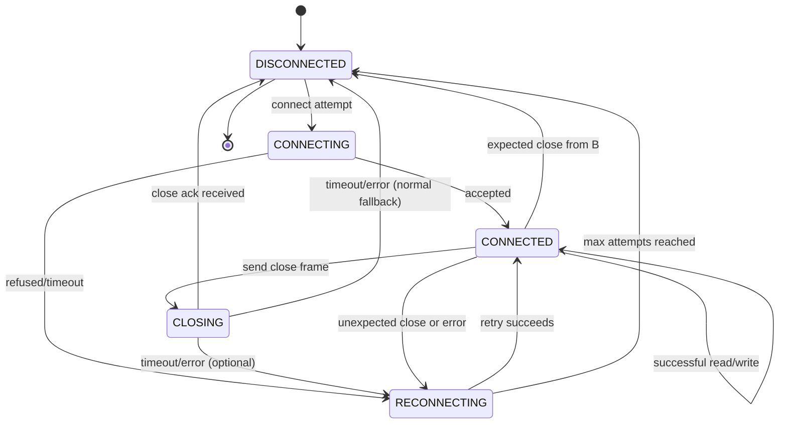

# WebSocket Client

A Go WebSocket client is thin layer around the [Gorilla websocket package](https://github.com/gorilla/websocket) implementing automatic reconnection and state management.

## State Machine

This WebSocket client implements a comprehensive state machine that handles all connection lifecycle events:



## 📦 Installation

```bash
go get github.com/mickaelvieira/websocket-client
```

## 🔧 Usage

### Basic Example

```go
package main

import (
    "log"
    "time"

    ws "github.com/mickaelvieira/websocket"
)

func main() {
    // Create client with custom configuration
    client := ws.NewClient("wss://echo.websocket.org", ws.WithLogger(slog.Default()))
    defer client.Close()

    // Monitor connection status
    go func() {
        for status := range client.Statuses() {
            if status.IsConnected() {
                log.Println("✅ Connected to WebSocket server")
            } else {
                log.Println("❌ Disconnected from WebSocket server")
            }
        }
    }()

    // Handle incoming binary messages
    go func() {
        for msg := range client.ReadBinaryMessages() {
            log.Printf("📨 Received: %v", msg)
        }
    }()

    // Handle incoming text messages
    go func() {
        for msg := range client.ReadTextMessages() {
            log.Printf("📨 Received: %s", msg)
        }
    }()

    // Send a message
    if err := client.SendTextMessage("Hello WebSocket!"); err != nil {
        log.Printf("❌ Send error: %v", err)
    }

    // Keep running
    time.Sleep(30 * time.Second)
}
```

### Configuration Options

```go
client := ws.NewClient("wss://api.example.com/ws",
    // Retry configuration
    ws.WithRetryInterval(1*time.Second),      // Wait between retries, default 5s
    ws.WithMaxRetryAttempts(5),               // Max reconnection attempts, default 60

    // Ping configuration
    ws.WithPingInterval(5*time.Second),       // Wait between pings, default 60s

    // Custom headers for authentication
    ws.WithHeaders(http.Header{
        "Authorization": []string{"Bearer " + token},
        "User-Agent":    []string{"MyApp/1.0"},
    }),

    // Custom logger
    ws.WithLogger(slog.New(slog.NewJSONHandler(os.Stdout, nil))),

    // Custom dialer configuration
    ws.WithDialerModifier(func(dialer *websocket.Dialer) {
        dialer.HandshakeTimeout = 5 * time.Second
    }),
)
```

## Testing

```bash
# Run the test suite
go test -v -race
```
